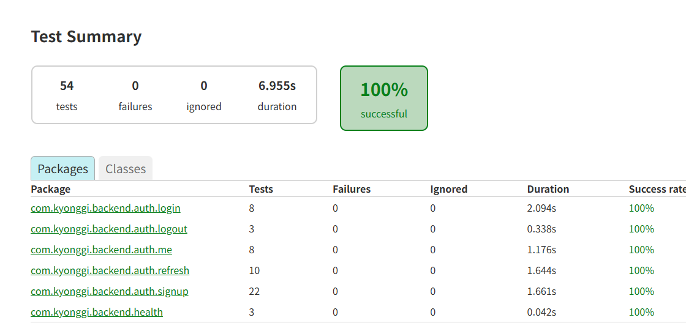
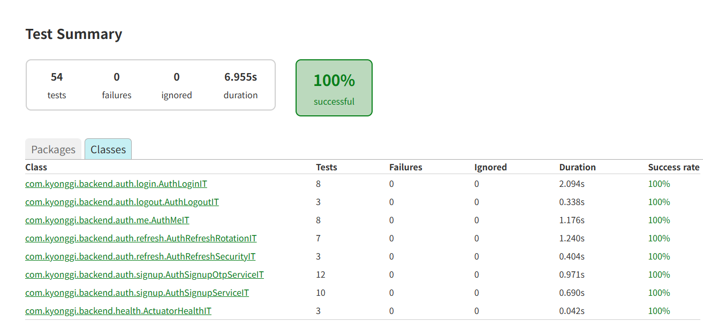
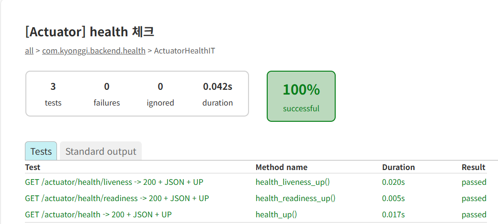
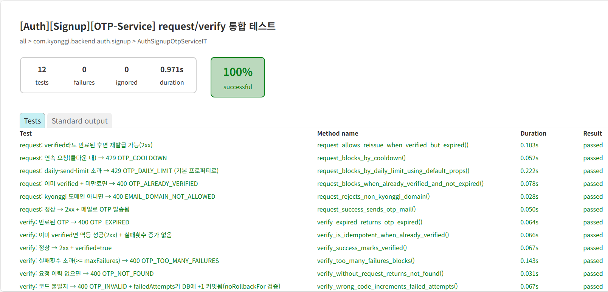
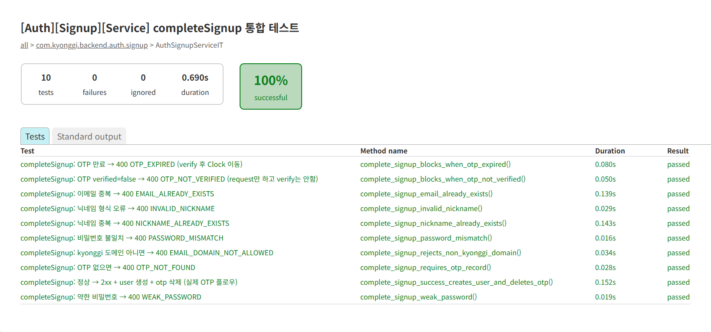
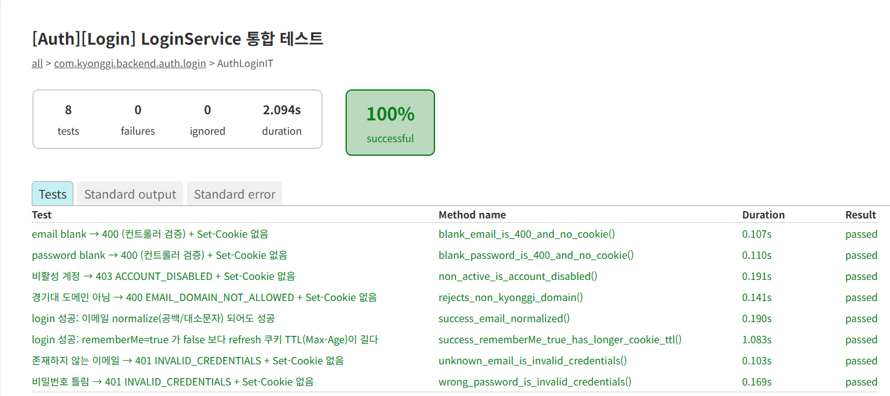
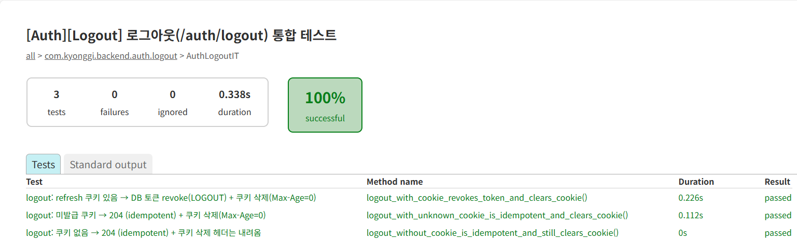
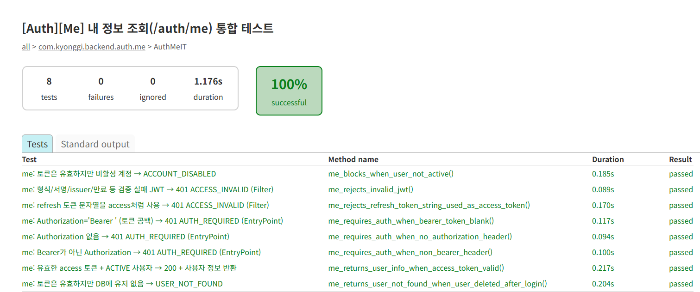
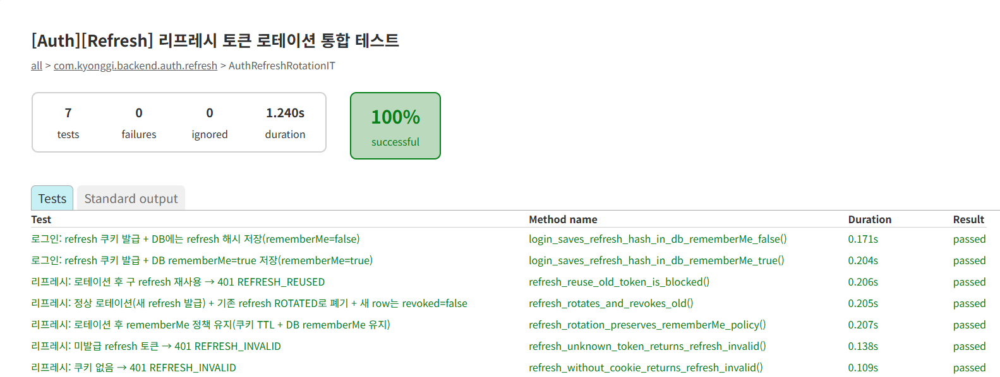
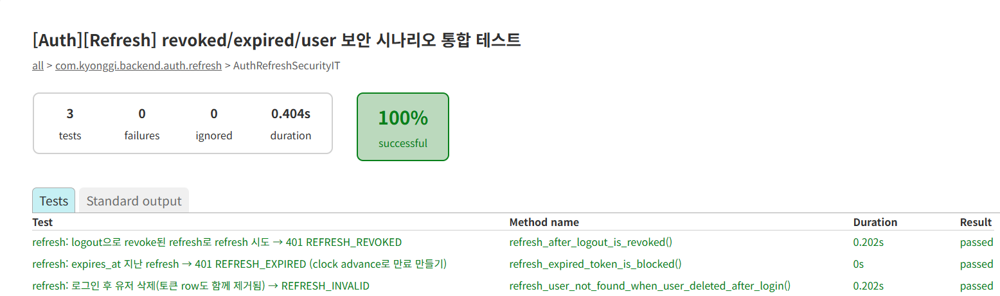

# TESTS — Automated Verification

이 문서는 **Auth 서브시스템의 정책/불변조건을 자동화 테스트로 고정**한 증빙이다.

- 운영 환경(Compose/k8s/prod SMTP) 재현은 `RUNBOOK.md`에서 스모크로 증명한다.
- 여기서는 **로직·보안·HTTP 계약이 깨지지 않는지**를 JUnit으로 검증한다.

---

## 1) 테스트 구성 (무엇을 검증하나)

- **Actuator**: `/actuator/health`, `/liveness`, `/readiness` 가 200 + JSON + `UP`.
- **Signup OTP**: 요청/검증 정책(쿨다운, 일일 제한, 만료, 실패횟수, 멱등성) + MailHog 전송.
- **Signup complete**: OTP 검증 상태/만료 + 이메일/닉네임/패스워드 정책.
- **Login**: 이메일 정규화, 비활성 계정 차단, rememberMe에 따른 refresh TTL 정책.
- **Me**: JWT 검증 실패(형식/서명/만료) 및 인증 요구 정책.
- **Refresh rotation**: DB에 refresh raw 미저장(해시), 로테이션 후 구 토큰 재사용 차단, rememberMe 정책 유지.
- **Refresh security**: 로그아웃 revoke, 만료 차단, 사용자 삭제 등 보안 시나리오.

> 테스트는 **Testcontainers(MySQL + MailHog)** 를 사용한다. Docker가 꺼져 있으면 실패한다.

---

## 2) 실행 방법

```bash
cd backend
./gradlew test
```

자주 쓰는 옵션:

```bash
./gradlew clean test
./gradlew test --info
./gradlew test --stacktrace
./gradlew test --no-daemon
./gradlew test --rerun-tasks

# 특정 클래스/패턴만
./gradlew test --tests "com.kyonggi.backend.health.ActuatorHealthIT"
./gradlew test --tests "*Auth*"
```

---

## 3) 리포트 열기 (WSL)

Gradle HTML 리포트 경로:
- `backend/build/reports/tests/test/index.html`

WSL에서 열기:

```bash
# WSL에 xdg-utils 있으면
xdg-open build/reports/tests/test/index.html
```

(참고) `xdg-open`이 없다면 `sudo apt-get update && sudo apt-get install -y xdg-utils`.

---

## 4) 증빙 스크린샷 (Gradle Test Report)

### 4.1 전체 요약




### 4.2 Health



### 4.3 Auth: Signup




### 4.4 Auth: Login / Logout / Me





### 4.5 Auth: Refresh (Rotation / Security)




---

## 5) 산출물 위치(필요할 때만)

- HTML report: `backend/build/reports/tests/test/`
- JUnit XML: `backend/build/test-results/test/`

